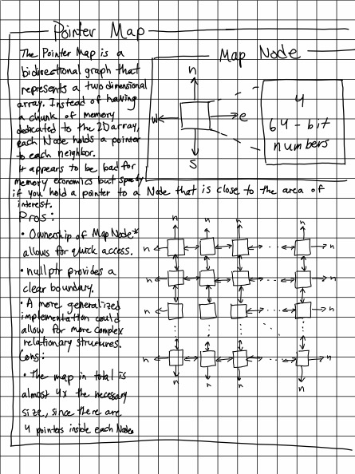

# Data Structures and Algorithms

## Data Structures
<ul>
    <li>Linked List (Single and Double)</li>
    <li>Queue and PriorityQueue</li>
    <li>Stack and Heap</li>
    <li>Binary Search Tree</li>
    <li>Graph (Point/Path, Vertex/Edge, Node/Pointer)</li>
</ul>

## Custom Data Structures
</img>

## Algorithms
<ul>
    <li>Search and Sort on Linked Lists</li>
    <li>MST, Prims, Kruskals, on Graph</li>
</ul>

## Visualizations
<ul>
    <li>Original Language Simulation with the Stack and Heap (Card Game Language)</li>
    <li>Tree Visualization</li>
    <li>Graph Visualization (Classical Euclidean and from MST/Prims/Kruskal</li>
</ul>